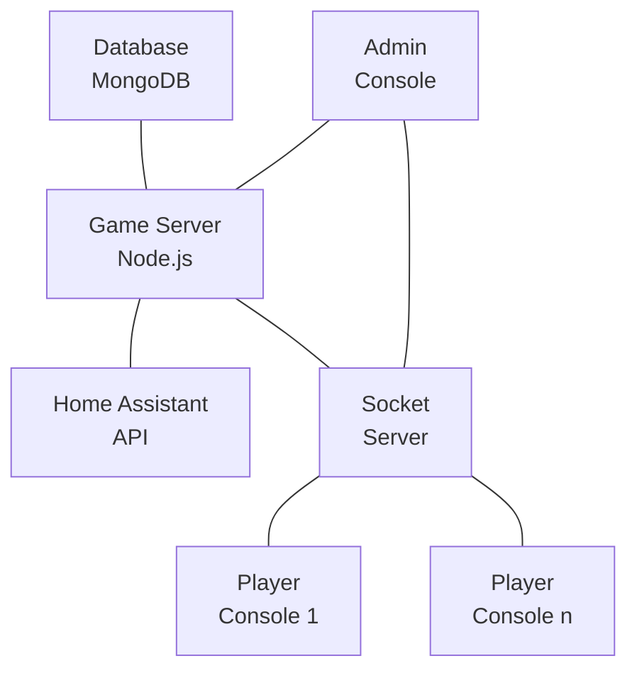

# Among Us IRL - System Architecture

## Project Overview

Among Us IRL is a platform that brings the popular "Among Us" game into real-world environments. It enables players to participate in a physical version of the game while using a web application to manage game mechanics, track tasks, and coordinate game flow.

The system consists of three major components:

1. **Game Server**: Node.js backend with Express, MongoDB, and Socket.IO
2. **Admin Console**: React-based web interface for game management
3. **Player Console**: Mobile-responsive React web app for players

## System Architecture

### High-Level Architecture



### Component Details

#### 1. Game Server

- **Technology**: Node.js, Express, MongoDB, Socket.IO
- **Purpose**: Manages game state, player actions, tasks, and integrates with Home Assistant
- **Key Features**:
  - RESTful API for game management
  - Real-time updates with Socket.IO
  - Authentication and authorization
  - Game mechanics implementation
  - Home Assistant integration for physical tasks

#### 2. Admin Console

- **Technology**: React, Material-UI
- **Purpose**: Interface for game administrators to create and manage games
- **Key Features**:
  - Create, configure, and monitor games
  - Manage players, rooms, and tasks
  - Track game progress in real-time
  - Override game mechanics when necessary
  - Generate QR codes for room and task verification

#### 3. Player Console

- **Technology**: React, Material-UI
- **Purpose**: Mobile interface for players to interact with the game
- **Key Features**:
  - View assigned tasks and current status
  - Complete tasks by scanning QR codes
  - Call emergency meetings or report bodies
  - Vote during discussion phases
  - Perform impostor actions like killing other players

##### Player Console Components

- **Map**: Interactive game map showing locations, tasks, and player positions
- **EmergencyButton**: Interface for calling emergency meetings with cooldown management
- **Discussion**: Chat and voting interface during emergency meetings
- **Sabotage**: Interface for impostors to trigger sabotage events
- **Kill**: Interface for impostors to eliminate crewmates
- **GameOver**: End-game screen showing game results and statistics

#### 4. MongoDB Database

- Stores game state, player information, tasks, rooms, and game logs
- Provides persistence across game sessions

#### 5. Home Assistant Integration

- Connects with Home Assistant for real-world effects
- Triggers lights, sounds, and other physical elements
- Supports REST API and optional MQTT communication

## Data Models

### Game Model

```javascript
{
  name: String,
  code: String,
  status: String, 
  createdBy: ObjectId, 
  startTime: Date,
  endTime: Date,
  settings: {
    numberOfImpostors: Number,
    emergencyMeetings: Number,
    discussionTime: Number,
    votingTime: Number,
    killCooldown: Number,
    taskBarUpdates: String, 
    visualTasks: Boolean
  },
  players: [ObjectId], 
  rooms: [ObjectId], 
  tasks: [ObjectId], 
  currentMeeting: {
    calledBy: ObjectId, 
    startTime: Date,
    endTime: Date,
    votes: Object 
  },
  logs: [{
    type: String, 
    timestamp: Date,
    player: ObjectId, 
    target: ObjectId, 
    task: ObjectId, 
    room: ObjectId, 
    message: String
  }]
}
```

### Player Model

```javascript
{
  name: String,
  color: String,
  deviceId: String,
  gameId: ObjectId, 
  role: String, 
  isAlive: Boolean,
  connected: Boolean,
  assignedTasks: [ObjectId], 
  completedTasks: [{
    task: ObjectId, 
    completedAt: Date
  }],
  currentRoom: ObjectId, 
  lastKill: Date,
  emergencyMeetingsLeft: Number,
  voteSubmitted: {
    votedFor: ObjectId, 
    meetingId: String,
    timestamp: Date
  },
  lastActiveAt: Date
}
```

### Task Model

```javascript
{
  name: String,
  description: String,
  type: String, 
  room: ObjectId, 
  gameId: ObjectId, 
  verificationMethod: String, 
  verificationData: String, 
  homeAssistantConfig: {
    entity_id: String,
    service: String,
    domain: String,
    data: Object
  }
}
```

### Room Model

```javascript
{
  name: String,
  description: String,
  gameId: ObjectId, 
  qrCode: String,
  homeAssistantEntities: [String],
  imageUrl: String
}
```

### User Model (Admin)

```javascript
{
  username: String,
  password: String, 
  email: String,
  role: String, 
  createdGames: [ObjectId] 
}
```

## Authentication Mechanisms

### Admin Authentication

- JWT-based authentication
- Token issued at login, verified on protected routes
- Tokens expire after 24 hours
- Protected routes prefixed with `/api` require valid JWT

### Player Authentication

- Device ID-based authentication
- Device ID generated on client and stored in local storage
- Device ID linked to player name and color during game registration
- Simple and user-friendly for casual game play

## API Endpoints

### Authentication Routes

- `POST /api/auth/register` - Register new admin
- `POST /api/auth/login` - Login admin
- `GET /api/auth/verify` - Verify token
- `POST /api/auth/logout` - Logout

### Game Routes

- `GET /api/games` - List all games
- `GET /api/games/:id` - Get game details
- `POST /api/games` - Create new game
- `PUT /api/games/:id` - Update game
- `POST /api/games/:id/assign-roles` - Assign roles
- `POST /api/games/:id/assign-tasks` - Assign tasks

### Player Routes

- `POST /api/players/join` - Join a game
- `POST /api/players/:gameId/leave` - Leave a game
- `GET /api/players/:gameId/info` - Get player info
- `POST /api/players/:gameId/task/:taskId` - Complete task
- `POST /api/players/:gameId/meeting` - Call emergency meeting
- `POST /api/players/:gameId/report/:playerId` - Report dead body
- `POST /api/players/:gameId/kill/:targetId` - Kill player
- `POST /api/players/:gameId/vote/:targetId` - Submit vote

### Task Routes

- `GET /api/tasks/game/:gameId` - Get all tasks for a game
- `GET /api/tasks/:id` - Get task details
- `POST /api/tasks` - Create task
- `PUT /api/tasks/:id` - Update task
- `GET /api/tasks/:id/qrcode` - Generate QR code
- `GET /api/tasks/verify/:code` - Verify task via QR code

### Room Routes

- `GET /api/rooms/game/:gameId` - Get all rooms for a game
- `GET /api/rooms/:id` - Get room details
- `POST /api/rooms` - Create room
- `PUT /api/rooms/:id` - Update room
- `GET /api/rooms/:id/qrcode` - Generate QR code
- `GET /api/rooms/verify/:code` - Verify room via QR code

### Home Assistant Routes

- `GET /api/home-assistant/status` - Get Home Assistant status
- `GET /api/home-assistant/entities` - Get entities
- `GET /api/home-assistant/entities/:entityId` - Get entity state
- `POST /api/home-assistant/service/:domain/:service` - Call service
- `POST /api/home-assistant/mqtt/publish` - Publish to MQTT topic
- `POST /api/home-assistant/events/:eventType` - Trigger game event

## Socket.IO Events

### Server-to-Client Events

- `admin:auth:success` - Admin authentication successful
- `admin:auth:error` - Admin authentication failed
- `player:auth:success` - Player authentication successful
- `player:auth:error` - Player authentication failed
- `game:update` - Game state updated
- `game:start` - Game started
- `game:end` - Game ended
- `player:join` - Player joined game
- `player:leave` - Player left game
- `player:update` - Player state updated
- `player:killed` - Player killed
- `meeting:called` - Meeting called
- `meeting:started` - Discussion started
- `meeting:ended` - Discussion ended
- `voting:started` - Voting started
- `voting:update` - Vote submitted
- `voting:ended` - Voting ended
- `task:completed` - Task completed
- `chat:message` - Chat message
- `error` - Error message

### Client-to-Server Events

- `admin:auth` - Admin authentication
- `player:auth` - Player authentication
- `admin:join:game` - Admin join game
- `player:join:game` - Player join game
- `player:complete:task` - Complete task
- `player:call:meeting` - Call meeting
- `player:vote` - Submit vote
- `player:kill` - Kill player
- `chat:message` - Send chat message

## Home Assistant Integration

### Configuration

- Environment variables:
  - `HOME_ASSISTANT_URL`: URL for Home Assistant API
  - `HOME_ASSISTANT_TOKEN`: Long-lived access token for authentication
  - `MQTT_BROKER`: MQTT broker URL (optional)
  - `MQTT_USERNAME`: MQTT username (optional)
  - `MQTT_PASSWORD`: MQTT password (optional)

### Integration Methods

1. **REST API**:
   - Direct API calls to Home Assistant for immediate actions
   - Used for triggering events, getting entity states
2. **MQTT**:
   - Pub/sub communication with Home Assistant
   - Used for real-time updates and monitoring

### Game Events

- `game-start` - Game starting
- `game-end` - Game ending
- `emergency-meeting` - Emergency meeting called
- `sabotage` - Sabotage triggered
- `task-complete` - Task completed
- `player-ejected` - Player ejected

## Deployment

### Docker Deployment

The project uses Docker Compose for easy deployment with the following services:
- MongoDB database
- Game server (Node.js)
- Admin console (React)
- Player console (React)

### Configuration

Environment variables are used for configuration:
- Database connection details
- JWT secret key
- Home Assistant connection
- Server ports and URLs

### Development Setup

1. Clone the repository
2. Run `docker-compose up -d` to start all services
3. Access the admin console at `http://localhost:3000`
4. Access the player console at `http://localhost:3001`

## Development Roadmap

### Current Status

- Basic server infrastructure implemented
- Data models defined
- Authentication system in place
- Socket.IO communication established
- Home Assistant integration implemented

### Future Development

1. **Frontend Development**:

   - Complete Admin Console UI
   - Complete Player Console UI
   - Implement responsive design
   - Optimize for mobile devices

2. **Backend Enhancements**:

   - Add more game customization options
   - Implement additional task verification methods
   - Enhance player proximity detection
   - Improve real-time sync for game events

3. **Testing and QA**:

   - Unit tests for backend APIs
   - Integration tests for Socket.IO events
   - End-to-end testing of game flow
   - Load testing for multiple concurrent games

4. **Documentation**:

   - Complete API documentation
   - User guides for admin and players
   - Setup instructions for different environments
   - Video tutorials for installation and usage

5. **Security Improvements**:

   - Rate limiting for APIs
   - Enhanced authentication mechanisms
   - Input validation enhancement
   - Security headers

## Troubleshooting

### Common Issues

- **Socket Connection Issues**: Check if CORS is properly configured
- **Database Connection**: Verify MongoDB connection string
- **Home Assistant Integration**: Confirm API token has sufficient permissions
- **QR Code Scanning**: Ensure proper lighting and camera permissions

### Logs Location

- Server logs available in docker logs
- Critical errors logged to server console
- Game events logged in the game model

## Contributing

### Development Workflow

1. Create a feature branch
2. Implement changes
3. Run tests
4. Submit pull request
5. Code review

### Coding Standards

- Follow ESLint configuration
- Use async/await for asynchronous operations
- Document all functions and components
- Follow the established architecture patterns

## References

- [Express.js Documentation](https://expressjs.com/)
- [Socket.IO Documentation](https://socket.io/docs/)
- [MongoDB Documentation](https://docs.mongodb.com/)
- [React Documentation](https://reactjs.org/)
- [Material-UI Documentation](https://material-ui.com/)
- [Home Assistant API Documentation](https://developers.home-assistant.io/docs/api/rest/)
